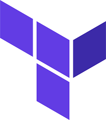
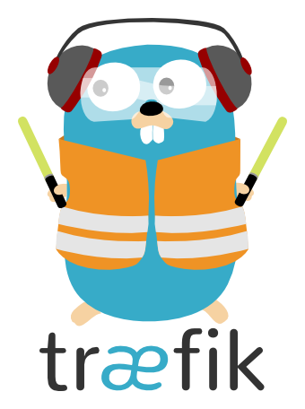

# Bienvenue sur mon Portfolio DevOps

    
    

        
Je suis <strong>Mehdi Kadar</strong>, un professionnel passionné par le DevOps, l'automatisation et l'optimisation des processus. Ce portfolio présente mes compétences, projets et articles.

    

    <a href="skills/terraform.md" style="text-decoration: none;">
        

            
        

    </a>
    <a href="skills/traefik.md" style="text-decoration: none;">
        

            
        

    </a>
    <a href="skills/ansible.md" style="text-decoration: none;">
        

            
        

    </a>
    <a href="skills/aws.md" style="text-decoration: none;">
        

            
        

    </a>

## Liens Utiles
- [À propos de moi](about.md)
- [Mes compétences](skills/index.md)
- [Mes projets](projects/)
- [Mon CV](cv.md)
- [Articles de blog](blog/)

